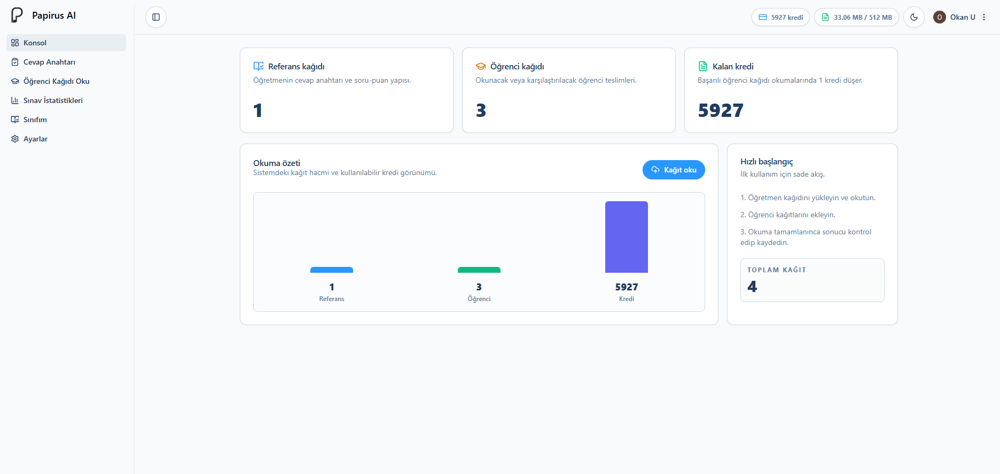

# Papirus-AI Dokümantasyonu

Papirus-AI, akademisyenlerin yazılı ve açık uçlu sınav kağıtlarını yapay zeka desteğiyle değerlendirmesine yardımcı olan modern bir sınav değerlendirme platformudur.

Klasik yazılı sınav süreçleri; kağıt okuma, puanlama, kontrol etme ve sonuçları düzenleme gibi zaman alan işlemler içerir. Papirus-AI bu süreci dijitalleştirerek değerlendirme süreçlerini daha hızlı, daha düzenli ve daha ölçeklenebilir hale getirir.



---

## Papirus-AI ile Neler Yapabilirsiniz?

Papirus-AI, yazılı sınav değerlendirme sürecini tek bir panel üzerinden yönetmenizi sağlar.

- Yazılı sınav kağıtlarını sisteme yükleyebilirsiniz
- Açık uçlu sorular için değerlendirme kriterleri oluşturabilirsiniz
- AI destekli ön değerlendirme başlatabilirsiniz
- Sonuçları manuel olarak kontrol edip düzenleyebilirsiniz
- Öğrenci bazlı ve soru bazlı analizleri görüntüleyebilirsiniz
- Değerlendirme sonuçlarını raporlayabilirsiniz

---

## Platform Nasıl Çalışır?

Papirus-AI, sınav oluşturma aşamasından sonuç raporlamaya kadar olan süreci adım adım yönetilebilir hale getirir.

```txt
1. Sınav oluştur
2. Soruları tanımla
3. Rubric oluştur
4. Öğrenci kağıtlarını yükle
5. AI değerlendirmesini başlat
6. Sonuçları incele
7. Rapor oluştur
```

Bu akış sayesinde akademisyenler, değerlendirme sürecini daha sistemli ve takip edilebilir şekilde yürütebilir.

---

## Desteklenen Özellikler

### Yapay Zeka Destekli Değerlendirme

Sistem, öğrenci cevaplarını tanımlanan rubric ve cevap anahtarlarına göre analiz eder. Bu analiz sonucunda akademisyene yardımcı olacak bir ön değerlendirme sunar.

### Açık Uçlu Soru Analizi

Papirus-AI, klasik test sistemlerinden farklı olarak açık uçlu cevapların değerlendirilmesini destekler. Öğrencinin cevabı yalnızca kelime eşleşmesiyle değil, içerik ve anlam bütünlüğüyle birlikte incelenir.

### El Yazısı ve OCR Desteği

Taranmış sınav kağıtları ve görseller üzerinde analiz yapılabilir. Kağıtların net, okunabilir ve düzgün taranmış olması değerlendirme kalitesini artırır.

### Manuel Kontrol Mekanizması

Akademisyenler AI tarafından verilen puanları inceleyebilir, düzenleyebilir ve nihai kararı kendileri verebilir. Papirus-AI bu süreçte karar verici değil, değerlendirme asistanı olarak konumlanır.

---

## Akademik Kullanım İçin Tasarlandı

Papirus-AI özellikle yazılı ve açık uçlu sınav değerlendirme yükünü azaltmak isteyen eğitim kurumları için geliştirilmiştir.

- Üniversiteler
- Özel okullar
- Kurs merkezleri
- Açık uçlu sınav değerlendirmesi yapan eğitim kurumları
- Akademisyenler ve öğretmenler

Platformun amacı, sınav değerlendirme sürecini hızlandırırken akademisyenin kontrolünü korumaktır.

---

## Sonraki Adımlar

Papirus-AI dokümantasyonunda ürünü adım adım tanımaya devam edebilirsiniz.

- [Papirus AI Nedir?](./papirus-ai-nedir)
- [Nasıl Çalışır?](./nasil-calisir)
- [Temel Özellikler](./temel-ozellikler)
- [AI Değerlendirme](./ai-degerlendirme)
- [Desteklenen Sınav Türleri](./desteklenen-sinav-turleri)