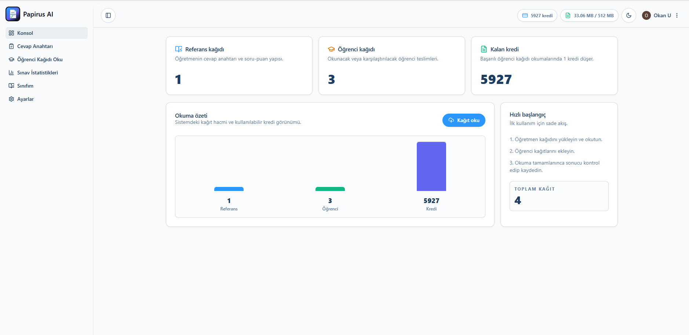

# Papirus AI Nedir?

Papirus AI, akademisyenlerin yazılı ve açık uçlu sınav kağıtlarını yapay zeka desteğiyle değerlendirmesine yardımcı olan modern bir sınav değerlendirme platformudur.

Klasik yazılı sınav süreçleri; kağıt okuma, puanlama, kontrol etme ve raporlama gibi zaman alan işlemler içerir. Papirus AI bu süreci dijitalleştirerek daha hızlı, daha düzenli ve daha ölçeklenebilir hale getirir.



---

## Bu Bölümde Neler Öğreneceksiniz?

Bu bölümde Papirus AI platformunun temel amacı ve çalışma yaklaşımı hakkında genel bilgi edineceksiniz.

- Papirus AI'nin ne işe yaradığı
- Hangi problemleri çözmeyi hedeflediği
- Kimler için geliştirildiği
- Platformun temel çalışma mantığı
- Yapay zeka destekli değerlendirme yaklaşımı

---

## Papirus AI Ne İşe Yarar?

Papirus AI, yazılı ve açık uçlu sınav kağıtlarının dijital ortamda analiz edilmesini ve değerlendirilmesini kolaylaştırır.

Platform sayesinde:

- Yazılı sınav kağıtları sisteme yüklenebilir
- Sorular için rubric tanımlanabilir
- Yapay zeka destekli ön değerlendirme alınabilir
- Sonuçlar manuel olarak incelenebilir
- Raporlama ve analiz işlemleri yapılabilir

Papirus AI özellikle çok sayıda sınav kağıdının değerlendirildiği süreçlerde akademisyenlerin iş yükünü azaltmayı hedefler.

---

## Hangi Problemleri Çözer?

Klasik sınav değerlendirme süreçleri genellikle:

- Çok fazla zaman alır
- Tekrarlayan manuel işlemler içerir
- Büyük sınıflarda yönetilmesi zor hale gelir
- Tutarsız puanlamalara neden olabilir
- Sonuçların analiz edilmesini zorlaştırabilir

Papirus AI bu süreçleri daha yönetilebilir hale getirerek değerlendirme akışını hızlandırmayı amaçlar.

---

## Kimler İçin Geliştirildi?

Papirus AI özellikle:

- Üniversiteler
- Özel okullar
- Kurs merkezleri
- Açık uçlu sınav yapan eğitim kurumları
- Akademisyenler
- Öğretmenler

için geliştirilmiştir.

Platform, yoğun değerlendirme süreçlerinde daha kontrollü ve daha düzenli bir çalışma yapısı oluşturmayı hedefler.

---

## Platformun Temel Yaklaşımı

Papirus AI tamamen otomatik karar veren bir sistem değildir.

Platformun temel yaklaşımı:

- Yapay zeka destekli analiz
- Akademisyen kontrolü
- Manuel inceleme
- Düzenlenebilir puanlama

mantığı üzerine kuruludur.

Sistem akademisyene yardımcı olacak ön değerlendirme üretir ancak nihai karar her zaman eğitmene aittir.

---

## Papirus AI İş Akışı

Platform genel olarak aşağıdaki süreç üzerinden çalışır:

```txt
1. Sınav oluştur
2. Soruları tanımla
3. Rubric oluştur
4. Kağıtları yükle
5. Yapay zeka analizini başlat
6. Sonuçları incele
7. Rapor oluştur
```

Bu yapı değerlendirme sürecinin daha sistemli ve daha takip edilebilir hale gelmesini sağlar.

---

## Yapay Zeka Destekli Değerlendirme

Papirus AI, öğrenci cevaplarını:

- Soru içeriği
- Beklenen cevap
- Rubric yapısı
- Anlamsal benzerlik
- Değerlendirme kriterleri

üzerinden analiz eder.

Bu süreç akademisyenlerin daha hızlı ve daha tutarlı değerlendirme yapmasına yardımcı olur.

Papirus AI'nin amacı akademisyenin yerine karar vermek değil, değerlendirme sürecini desteklemektir.

---

## Sonraki Adım

Bir sonraki bölümde platformun teknik ve operasyonel çalışma mantığını daha detaylı inceleyebilirsiniz.

→ [Nasıl Çalışır?](./nasil-calisir)